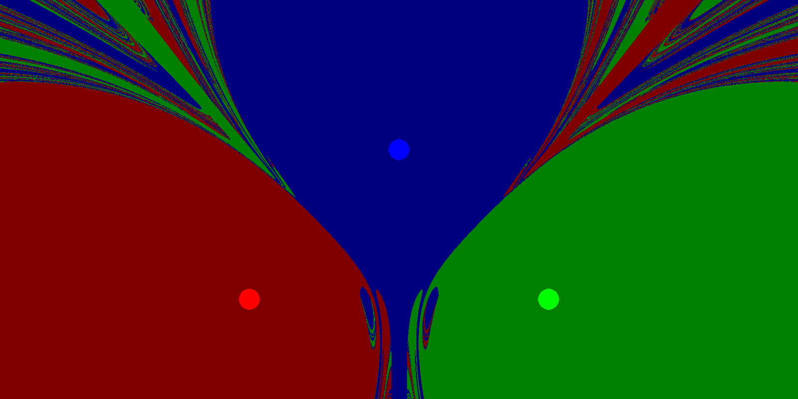

This program aims to replicate what was done in 2Swaps' YouTube video [༄ GRAVITY BASINS ࿐](https://www.youtube.com/watch?v=LavXSS5Xtbg)

# **Concept Description:**
  There are multiple gravitational bodies spread out across the screen each with a different color, every
  pixel is then mapped with a color corresponding to which planet a particle would fall into if placed on that pixel

# **Program Descriptions:**  

## **Interactive.py:** 
a program where the background in pre-rendered so the program can start up as soon as you run it,
using the file WellFieldPre.png as the background  

## **Render.py:**
The background is newly generated upon each run of the program, which may take a few minutes. 

Note that if a net gravitational field of zero is located exactly on a pixel, or is there is a large negative mass redering could stall infinitely.

If you desire to set your own coordinates, masses and colors modify the *Planets* array, planets are initialized with the following variables Planet([X Coordinate, Y Coordinate],  Mass,  Color), with Color being a list of RGB.

Upon starting the program you will see a countdown going from "x = 0 / 1600" and upon reaching "x = 1600 / 1600" the program will start.
  
