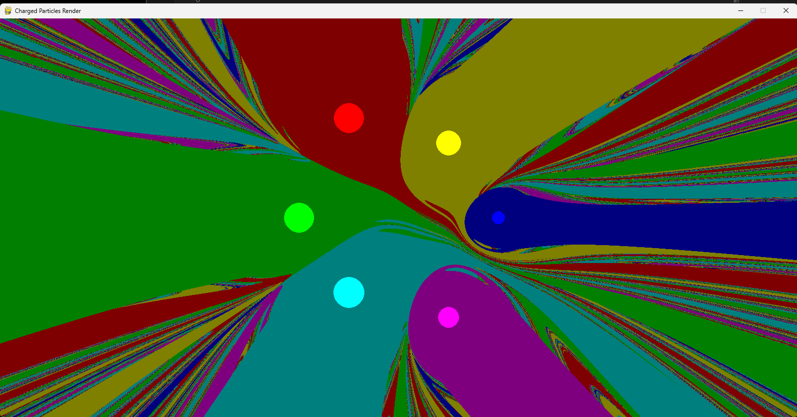
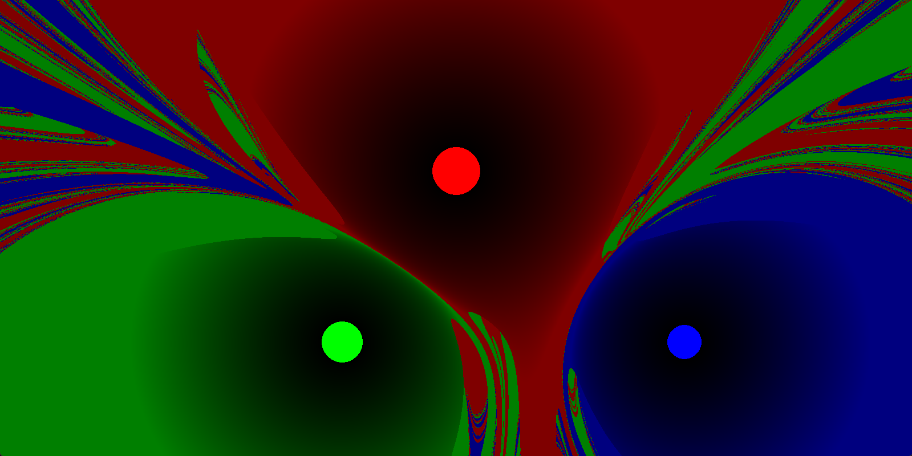

This program aims to replicate what was done in 2Swaps' YouTube video [༄ GRAVITY BASINS ࿐](https://www.youtube.com/watch?v=LavXSS5Xtbg)
Note that the files WellField1.png up through WellField10 serve to document my iterative process when coding this

# **Concept Description:**
  There are multiple gravitational bodies spread out across the screen each with a different color, every
  pixel is then mapped with a color corresponding to which planet a particle would fall into if placed on that pixel

## **Render.py:**
The background is generated upon each run of the program, which may take a few minutes. 

Note that if there is a way for a particle to never collide into a planet with your current planet layout the redering could stall infinitely (This could be from a number of things, most likely is directly between two planets or reaching escape velocity from being repeled by a negative mass).

If you desire to set your own coordinates, masses and colors modify the *Planets* array, planets are initialized with the following variables Planet([X Coordinate, Y Coordinate],  Mass,  [Red, Blue, Green]).

Upon starting the program you will see a countdown going from "x = 10 / 1600" and upon reaching "x = 1600 / 1600" the program will start.
  

## **Left Click**
Left clicking on the window will create a particle that will be effected by the planets gravity and will be the color of the planet it is to collide into

## **Right Click**
Holding down right click will have a line be drawn starting at the cursor and following the trajectory of a particle were it to be placed at your cursor

## **scaled**
The variable *scaled* if set to true will cause the background to be lighter the longer it takes a particle to collide with a planet from that point up to *scaleTimeSpan* as show below
  
